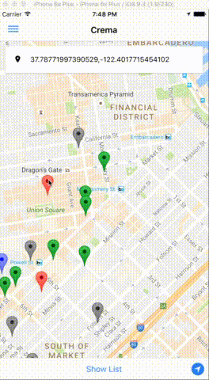

# Crema - Mobile


Find the nearest coffee shops that you can work from. <br/>




## How To Run Application


### Install Ionic 2 and Cordova

If you do not have Ionic 2 or Cordova installed:
```bash
# Ionic & Cordova CLI
npm install -g ionic@beta
npm install -g cordova

# iOS simulator starter & deployer
npm install -g ios-sim
npm install -g ios-deploy
```


### iOS Emulator

1. Fork the repo `git clone https://github.com/Political-Tambourine/crema.git && cd crema`
2. Install package dependencies: `npm install`
3. Add iOS as platform: `ionic platform add ios@4.1.1` <br/>
   Latest version may be unstable - use version 4.1.1
4. Install Geolocation Cordova plugin: `ionic plugin add cordova-plugin-geolocation`
5. Install Native GoogleMap Cordova plugin: `ionic plugin add https://github.com/phonegap-googlemaps-plugin/cordova-plugin-googlemaps --variable API_KEY_FOR_IOS="YOUR_API_KEY"` <br/>
   **NOTE:** As of 7/20/16 - _cordova-plugin-googlemaps_ npm registry points to an old version of the plugin that is incompatible with Cordova iOS 4+. So we are installing from Git repo's HEAD (https://github.com/phonegap-googlemaps-plugin/cordova-plugin-googlemaps)
6. Prepare plugins for build: `cordova prepare`
7. Build and run emulator: `ionic emulate ios` <br/>
   - You can specify target device by adding *target* flag `ionic emulate ios --target` <br/>
   - During development, you should run the emulator with _live-reload_ and _consolelogs_ flags `ionic emulate ios -lc`

Note:
* If build fails - try running `cordova plateform update ios` and re-run the emulator again
* If app runs on the emulator but throwing "GoogleMaps plugin not found" error, try removing googlemaps plugin, the ios platform, and reinstalling them
  ```bash
  cordova plugin rm plugin.google.maps
  cordova plugin rm cordova-plugin-googlemaps
  cordova plugin rm com.googlemaps.ios
  cordova plugin add https://github.com/phonegap-googlemaps-plugin/cordova-plugin-googlemaps --variable API_KEY_FOR_IOS="YOUR_API_KEY"
  ```
